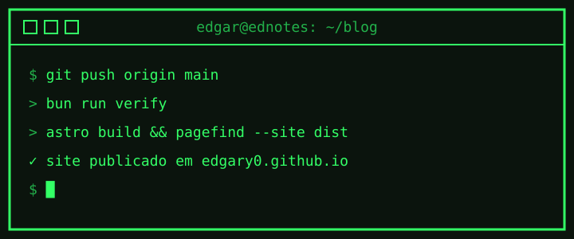

Este é o primeiro post do **EdNotes**. A ideia é simples: anotar aqui o que eu aprendo sobre código, ferramentas e o que mais aparecer pelo caminho.



## Como o blog funciona

Cada post é um arquivo Markdown em `src/content/posts/`. O cabeçalho do arquivo diz o título, a data e as tags:

```yaml
---
title: "Olá, mundo"
date: 2026-10-07
description: "Primeiro post do EdNotes"
tags: [blog, astro]
---
```

Quando o arquivo chega no GitHub, um workflow gera as páginas com o [Astro](https://astro.build) e publica tudo no GitHub Pages. Se o cabeçalho tiver algum erro, o build falha e o site continua como estava.

## O que vem por aí

- notas de estudo;
- ferramentas que uso no dia a dia;
- projetos pessoais.

> Para acompanhar, assine o [RSS](/rss.xml) ou use a busca com `Ctrl+K`.
